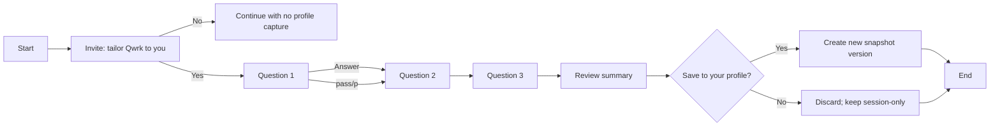
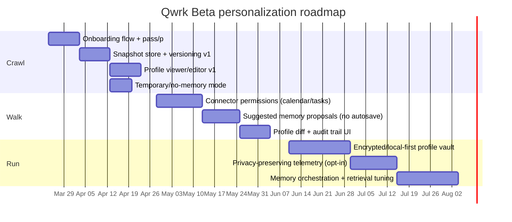

# Consent-First User Modeling for Qwrk Beta

## Executive summary

Qwrk cannot “know you” in a way that reliably improves performance until it has a small set of **stable, high-signal user attributes** (working style, goal horizon, decision cadence, preferred outputs, avoidances) and a **trustworthy mechanism** to store and revise them with explicit consent. Without those, any personalization will be either shallow (tone tweaks) or risky (wrong assumptions that feel invasive). This is consistent with long-standing human–AI interaction guidance: systems should make their capabilities and uncertainties clear, support efficient correction, and avoid surprising users. citeturn1search0turn2search2

A “progressive profiling” approach—asking **one question at a time**, allowing “pass/p,” stopping at any time, and revisiting later—matches both privacy-first principles (data minimization, “by default” protections) and interaction design best practices for calibrating trust and reducing friction. citeturn2search5turn5search7turn1search0

The hard part is not the questions; it is the **memory contract**. To honor a strong consent requirement and the product promise (“never shared without express consent”), Qwrk needs a storage architecture that cleanly separates **ephemeral context** from **durable profile “snapshots,”** with explicit save confirmation, versioning, editability, and revocation (including deletion). These controls align with GDPR-style rights such as consent withdrawal and erasure and with privacy-by-design expectations. citeturn6search2turn6search0turn2search5

A pragmatic Crawl → Walk → Run roadmap is viable:
- **Crawl (MVP)**: minimal onboarding (3 questions), explicit “Save to Profile?” confirmation, profile viewer/editor, and “Temporary/No-memory mode.”
- **Walk**: structured preferences, connectors (calendar/tasks) gated by explicit permission, profile versions, and safe “suggested memory” proposals.
- **Run**: privacy-preserving telemetry (opt-in), local-first or encrypted client vault options, selective disclosure, plus advanced memory orchestration (tiered memory/RAG policies) inspired by contemporary agent memory research. citeturn3search2turn5search7turn3search13

Comparative analysis shows why this is a differentiator: Apple emphasizes on-device processing for personalization where possible; Microsoft 365 Copilot’s value comes from secure grounding in tenant data and clear commitments that prompts/responses and accessed tenant data are not used to train foundation models; Replika emphasizes layered memory with some user-visible controls; and ChatGPT’s memory model highlights user controls to toggle and delete saved memories. Qwrk can combine the best parts—**clear controls + progressive trust + explicit snapshotting**—while keeping the “don’t be creepy” bar high. citeturn0search4turn0search2turn0search11turn5search2

## User knowledge that actually improves Qwrk’s performance

### Treating current user data as unknown

If we treat Qwrk’s current available user data as unknown (no assumptions about signup fields, device identifiers, or existing CRM enrichment), the only universally dependable signal at first interaction is **what the user types/says in-session**. This creates a “cold start” problem analogous to recommender systems and conversational recommenders: without prior preference data, systems either ask questions (explicit elicitation) or attempt inference (implicit modeling), each with tradeoffs in friction vs. error risk. citeturn4search2turn4search6

From an AI–human interaction standpoint, the early phase should optimize for:
- **Reducing uncertainty fast** (a few high-value attributes),
- **Avoiding overconfident personalization** (false positives),
- **Making correction easy** (user control),
- **Preventing surprise** (privacy/trust). citeturn1search0turn2search2

### A rigorous way to answer “How well do you know me?”

Instead of a vague “I know you well,” Qwrk should implement a **profile coverage model**: a bounded checklist of attributes that are known/unknown, last-confirmed date, confidence source, and user-editability.

A useful operational definition:

**Qwrk knows you well** when it can consistently do the following without re-asking basics or making jarring mistakes:
- Produce outputs in your preferred format and depth.
- Make “good default decisions” on timing, follow-ups, and tradeoffs.
- Respect your constraints/avoidances reliably.
- Use your tools/context (calendar/tasks/docs) appropriately with permission. citeturn1search0turn0search6

This definition aligns with trust research in automation: trust should be calibrated to system competence and context; over-trust and under-trust both harm outcomes (“misuse” vs. “disuse”). citeturn2search2turn2search7

### High-value user attributes for Qwrk

The highest ROI attributes share three properties: they are **stable**, **widely applicable**, and **actionable** in most tasks. Below is a prioritized set aligned to your requested dimensions.

**Working style and interaction contract**
- preferred response structure (brief → reasoning → options → actions)
- pace: “fast and decisive” vs “thorough and cautious”
- autonomy: “ask before acting” vs “default and notify”
These map directly to conversation policy and planning behavior. citeturn1search0turn2search2

**Goals and horizon**
- near-term objectives (this week/month)
- long-term goals (career, product, health, family)
Goal context improves relevance and reduces generic advice. Modern agent architectures explicitly rely on goals/plans plus memory retrieval to behave coherently over time. citeturn3search3turn3search7

**Domain expertise and vocabulary**
- what you do (role), your tools, and how technical you want explanations
This reduces “explain like I’m five” failures and improves grounding choices. citeturn1search0turn0search6

**Decision-making style**
- your default tradeoff posture (speed vs. accuracy; risk tolerance)
- how you like uncertainty handled (explicit confidence, citations, assumptions)
Trust literature emphasizes appropriate reliance; exposing uncertainty and enabling oversight improves calibrated use. citeturn2search2turn1search0

**Constraints and avoidances**
- topics to avoid, boundaries, sensitive areas
- any “never do X” instructions
This is often more important than “favorite color” personalization because it prevents harm and creepiness. GDPR-like minimization and privacy-by-default norms reinforce collecting only what’s needed. citeturn2search5turn5search3

**Recurring contexts**
- weekly routines, meetings, operating cadence
This is the on-ramp to calendar/task integration, which is where assistant usefulness scales—if consented and secure. citeturn0search6turn0search2

**Preferred output formats**
- checklists, decision trees, templates, citations, diagrams
This is a low-risk, high-payoff preference class because it’s rarely sensitive and strongly improves perceived helpfulness. citeturn1search0

### Minimal viable onboarding questions

A minimal set should target **high leverage + low sensitivity**. Conversational elicitation research suggests that structured guidance can improve objective efficiency and accuracy, but too much restriction can increase perceived burden—meaning “few, well-chosen questions” is the sweet spot for onboarding. citeturn4search9turn4search2

Recommended first three questions (MVP):

1) **“What do you want me to help you with most often?”**  
   (Examples: planning your day, writing, research, decisions, reminders, brainstorming.)

2) **“When I answer, do you prefer quick results or thorough analysis?”**  
   (Offer a simple toggle: Quick / Balanced / Deep.)

3) **“Any constraints or things you want me to avoid?”**  
   (Examples: “Don’t store personal details,” “Avoid medical advice,” “Don’t be overly chatty,” etc.)

These three create an initial interaction contract without demanding personally identifying data.

## Consent, privacy, and trust constraints

### Interpreting the “never shared without express consent” promise

A literal interpretation—**no sharing with any third party**—can conflict with standard cloud architectures (hosting providers, analytics, crash reporting, LLM API vendors). Even Apple’s Siri legal documentation describes processing and storage and notes use of “trusted third-party service providers” in some cases. citeturn0search0

To keep the promise both strong and operationally true, Qwrk should define “share” in user-facing terms and separate:
- **service providers acting as processors** (e.g., hosting, LLM inference), under strict contractual/data-use limits, versus
- **third parties acting as independent controllers** (ads networks, resale partners), which should be forbidden without explicit opt-in.

Microsoft 365 Copilot’s positioning is instructive: it makes explicit commitments about how prompts, responses, and data accessed via Microsoft Graph are handled and that they aren’t used to train foundation models. That kind of crisp boundary is what users interpret as “not shared/not used.” citeturn0search2turn0search6

### Strong consent requirement and privacy-by-design implications

If Qwrk assumes a strong consent requirement, the design should behave as if the user can:
- **withdraw consent at any time** (and Qwrk must honor it), citeturn6search2turn6search7
- request deletion/erasure of stored profile data, citeturn6search0turn6search11
- correct inaccuracies (rectification), citeturn5search13
- access what’s stored and why, citeturn6search8
- and default to minimal collection (“data protection by design and by default”). citeturn2search5turn2search13

Contextual Integrity provides a practical lens for conversational assistants: privacy violations often occur when information flows feel **inappropriate for the context**, even if the user technically disclosed the data. This is exactly the “creepiness” failure mode in personalized agents. citeturn2search0turn2search4

### Trust calibration rules for a personalized assistant

Trust work in automation and human–AI interaction guidelines converge on a few actionable rules:
- communicate what the system is doing and why,
- show uncertainty when relevant,
- make it easy to correct,
- avoid silent behavior changes that surprise the user. citeturn2search2turn1search0

This is why “profile snapshots” with explicit confirmation is more than UX polish—it’s trust architecture.

### Privacy-preserving options for Qwrk

A tiered strategy lets Qwrk scale privacy features with maturity:

**Local-first profile vault (best alignment with promise)**  
Store durable user profile encrypted on device; server sees only ciphertext or not at all. This aligns with Apple’s public emphasis on on-device processing for personalization where possible. citeturn0search4

**Selective disclosure and progressive trust**  
Use selective disclosure patterns—ask for the minimum needed now, and only request more in future contexts when the value exchange is obvious. W3C work on minimization and “progressive trust” captures this philosophy explicitly. citeturn5search7turn5search3

**Privacy-preserving learning/telemetry (opt-in)**  
If Qwrk wants aggregate product analytics without collecting raw conversational data, federated learning and differential privacy are established primitives:
- Federated learning keeps training data on-device and sends updates rather than raw records. citeturn3search13turn3search1  
- Differential privacy formalizes privacy loss bounds when releasing aggregate statistics. citeturn3search8turn3search0

## Memory storage and architecture

### Ephemeral vs durable memory

A consent-first assistant benefits from three distinct “memory tiers”:

**Session context (ephemeral)**  
Used to answer within the current conversation. Automatically expires.

**Working context (time-bounded)**  
Short-lived continuity (e.g., current project for 7–30 days) with a defined TTL.

**Profile memory (durable, user-confirmed)**  
Stable preferences/goals/constraints. Stored only after explicit “save” consent, and always editable.

This resembles how some modern assistants separate “chat history” vs “saved memory” controls; for example, ChatGPT’s memory FAQ emphasizes user controls to delete and toggle saved memories and introduces “Temporary Chat” for no-memory sessions. citeturn5search2

### Snapshot model with versioning and revocation

A “snapshot” should be treated as a **versioned profile state** with:
- `profile_version_id`
- `effective_from`
- `source` (user answer, user edit, inferred suggestion accepted)
- `consent_event_id`
- `revoked_at` (nullable)
- `replaced_by_version_id` (nullable)

This design supports:
- deterministic rollback,
- auditability (“how did we learn this?”),
- user-driven edits,
- deletion.

These are consistent with privacy-by-default expectations and consent withdrawal principles. citeturn2search5turn6search2

### Reference architecture

Modern LLM agent research emphasizes that managing limited context windows requires explicit memory systems (external stores + retrieval + summarization/reflection). MemGPT frames this as “virtual context management,” paging between fast context and external memory. Qwrk can use these concepts while keeping durable profile storage consent-gated. citeturn3search2turn3search14

```mermaid
flowchart TB
  U[User] -->|messages| A[Conversation Orchestrator]
  A --> C[Session Context<br/>(ephemeral)]
  A --> R[RAG Retrieval Layer]
  R --> K[Knowledge Sources<br/>(docs, notes, web if allowed)]
  A -->|propose| M[Memory Candidate Extractor]
  M -->|requires confirmation| CE[Consent Event]
  CE -->|approved| P[(Profile Snapshot Store<br/>versioned)]
  CE -->|denied| D[(Discard)]
  P --> R
  C --> A
```

### Example data schema

| Entity | Purpose | Key fields | Consent posture |
|---|---|---|---|
| `consent_event` | Immutable record of the user’s permission decision | `consent_event_id`, `timestamp`, `scope`, `text_shown`, `decision` | Required for any durable save; supports “demonstrate consent” expectations. citeturn6search2turn6search7 |
| `profile_snapshot` | Versioned durable profile | `profile_version_id`, `user_id`, `effective_from`, `revoked_at`, `summary_json` | Saved only after explicit confirmation; revocable/deletable. citeturn6search0turn6search11 |
| `profile_attribute` | Individual structured attribute values | `attribute_key`, `value`, `confidence`, `source`, `last_confirmed_at` | Values can be user-entered or user-approved suggestions; never silent “hard set.” citeturn1search0turn2search2 |
| `memory_candidate` | Proposed memory awaiting approval | `candidate_id`, `extracted_text`, `proposed_attribute`, `rationale` | Must be shown to user; default discard unless accepted. citeturn2search5turn1search0 |
| `deletion_request` | Tracks erasure workflows | `request_id`, `requested_at`, `scope`, `completed_at` | Supports right-to-erasure style expectations. citeturn6search0turn6search11 |

## UX flows and scripts

### Entry triggers

Use **contextual, value-based triggers**, not mandatory onboarding. Examples:
- first interaction: “Want to set how I work with you?”
- when user shows repeated pattern (“Give me bullet checklists every time”): “Want me to remember this preference?”

This aligns with contextual integrity: the request appears when it’s appropriate and useful, reducing the “why are you asking me this now?” reaction. citeturn2search0turn5search7

### One-question-at-a-time flow with pass/p and explicit save



### Sample phrasing scripts

**Invite (first turn after greeting)**  
“Before we dive in: I can tailor my working style to you. Want to answer a few quick questions—one at a time? You can type **p** to pass, and we can stop whenever.”

**Question prompt template**  
“Question *X*: [question].  
Reply with: [options], or **p** to pass.”

**Save confirmation (hard gate)**  
“Here’s what I captured. Want me to **save this to your profile** so I use it next time?  
- **Yes, save**  
- **No, don’t save** (we’ll keep going without storing it)”

This explicit commitment to user control reflects widely recommended HAI patterns: enable correction and user control, and avoid surprising behavior changes. citeturn1search0turn1search1

### Consent language that’s strong but implementable

If you want the “Joel promise” to be durable, consider wording that separates (a) service operation from (b) onward sharing:

Recommended consent microcopy (example):
- “I’ll only store what you approve in your profile.”
- “You can view, edit, or delete it anytime.”
- “Qwrk will not sell or share your profile with third parties for their own use. If we use service providers to run Qwrk (hosting/inference), they’re bound to use your data only to provide the service.”

This matches how enterprise assistants emphasize boundaries on training and data use (e.g., Copilot’s stance on prompts/responses and tenant data not training foundation models). citeturn0search2turn0search14

### Creepiness mitigation strategies

Creepiness is usually caused by **surprise + sensitivity + incorrect inference**. A practical mitigation stack:
- prefer low-sensitivity preferences first (format, depth),
- avoid “psychoanalyzing” language,
- never claim certainty about inferred traits,
- show what you plan to remember before saving,
- provide a visible “Profile” page and “Temporary Mode.” citeturn2search0turn5search2

Replika’s public description of layered memory—some visible, some “deeper”—is a cautionary tale: even if it improves continuity, opaque memory can create discomfort if users can’t see or control what’s being retained. citeturn0search11turn0search19

## Measurement, evaluation experiments, and A/B tests

### Metrics for success

A balanced scorecard should include:

**Engagement and retention**
- onboarding opt-in rate
- completion rate of first 3 questions
- return rate (D1/D7/D30), session frequency

**Personalization accuracy**
- “preference adherence rate” (did outputs match chosen format/depth?)
- correction rate (“Actually, I prefer…”) per 100 turns
- false-positive personalization incidents (system applied a preference the user disputes)

**User satisfaction**
- post-session CSAT
- standardized conversational UX measures (e.g., chatbot usability instruments proposed in academic work) citeturn4search23

**Trust and privacy comfort**
- “creepiness” rating item (“Did Qwrk ask for anything uncomfortable?”)
- % of users who review/edit profile
- memory toggle-off rate (a negative signal if high)

### Evaluation experiments

**A/B test ideas (high signal, low ambiguity)**
- Invite framing: “tailor my working style” vs “create your profile”
- Question format: free text vs 3-option with “Other”
- Save gate: immediate “save after 3” vs “save each answer” (expect higher friction if too frequent)
- Profile UI: “view-only summary” vs “editable fields + audit trail”

**Behavioral experiments**
- Measure task success on repeated workflows (e.g., create an agenda, write an email) before and after profile capture.
- “Trust calibration” experiment: show uncertainty markers vs none; assess reliance and correction rates, consistent with trust-in-automation concerns about misuse/disuse. citeturn2search2turn2search7

### Privacy-preserving telemetry options

If Qwrk wants product analytics while honoring strict privacy posture:
- default to event counts and coarse metrics
- make telemetry opt-in
- explore federated analytics/learning approaches and/or differential privacy for aggregated metrics. citeturn3search13turn3search8

## Crawl–Walk–Run roadmap, timeline, and resourcing

### Crawl phase

Milestones (concrete):
- Consent-based onboarding flow (3 questions + pass/p).
- Explicit save confirmation creating `profile_snapshot v1`.
- Profile viewer/editor (basic structured fields).
- “Temporary / No-memory” session mode (no durable saves; no referencing profile).
- Basic audit trail: when saved, what changed.

This mirrors the control surfaces emphasized by systems with memory features (e.g., user can delete or disable saved memories). citeturn5search2

### Walk phase

Milestones:
- Expand attribute schema: goals, cadence, tool preferences, avoidances taxonomy.
- Connection permissions: calendar/tasks/docs with clear scope and revocation; implement “least privilege.”
- “Suggested memory” proposals extracted from conversation, but **never auto-saved**.
- Profile version diff UI (“what changed since last save?”).

Grounding assistants in the user’s real context is where usefulness explodes; Microsoft 365 Copilot’s architecture explicitly describes grounding via Microsoft Graph to access user-tenant data for relevance, while emphasizing privacy constraints. Qwrk can replicate the “grounding” value with your own connector ecosystem. citeturn0search6turn0search2

### Run phase

Milestones:
- Local-first encrypted profile vault option (or end-to-end encryption for snapshots).
- Selective disclosure: share only needed attributes per feature (“progressive trust”).
- Tiered memory orchestration (session/working/profile) + retrieval tuning.
- Opt-in privacy-preserving telemetry (federated learning/DP where appropriate).
- Advanced evaluation pipeline and continuous trust monitoring.

Modern agent memory work (e.g., MemGPT) suggests that long-term helpfulness is largely a memory-management problem; Qwrk’s differentiator is doing it with explicit consent boundaries and user control. citeturn3search2turn3search14

### Timeline



### Resource estimate

Rough person-week estimates (assumes a small, competent product team; these are planning estimates, not empirical facts):
- Product/Founder (you): 2–4 pw across phases (spec, copy, risk decisions)
- Product design (UX/UI + content): 3–6 pw (Crawl+Walk)
- Backend engineer: 6–10 pw (snapshot store, consent events, APIs, deletion workflows)
- Client engineer: 4–8 pw (flow UI, profile editor, settings/modes)
- ML/Applied AI engineer: 4–10 pw (memory candidate extraction, retrieval tuning)
- Security/privacy review: 2–4 pw (threat model, encryption posture, vendor DPAs)
- QA: 2–4 pw (edge cases, revocation, regression)

If Qwrk is aiming for stronger guarantees (“never shared” in the literal sense), budget additional effort for local-first inference or bring-your-own-model deployments.

### Prioritized backlog

| Priority | Item | User impact | Effort | Key risks |
|---|---|---:|---:|---|
| P0 | 3-question progressive onboarding + pass/p | High | Medium | Copy/tone misfire; completion drop |
| P0 | Explicit save confirmation + snapshot v1 | High | Medium | Consent ambiguity; audit gaps citeturn6search2turn2search5 |
| P0 | Profile viewer/editor v1 | High | Medium | Confusing UI; missing revocation |
| P1 | Temporary/no-memory mode | High | Low–Medium | Users misinterpret what’s saved citeturn5search2 |
| P1 | Consent event log + “what I know” page | High | Medium | Feels “cold” if too legalistic citeturn6search8turn1search0 |
| P1 | Suggested memory proposals (never auto-save) | Medium–High | Medium | False positives; creepiness citeturn2search0turn2search2 |
| P2 | Connector permissions (calendar/tasks) | Very High | High | Scope creep; security boundary citeturn0search6turn0search2 |
| P2 | Version diff UI + rollback | Medium | Medium | Complexity; user confusion |
| P3 | Local-first encrypted profile vault | Very High (trust) | High | Platform complexity; key mgmt citeturn0search4turn3search13 |
| P3 | Opt-in privacy-preserving telemetry | Medium | Medium–High | Utility vs cost tradeoff citeturn3search8turn3search13 |

## Comparative landscape and tradeoffs

### Why comparisons matter

Competing assistants cluster into two camps:
- “Personalization via platform data” (calendar/email/docs) with enterprise/privacy claims.
- “Relationship companions” with long-term memory, sometimes less transparent.

Qwrk can differentiate by combining **enterprise-grade control surfaces** with **relationship-grade continuity**, using explicit snapshotting and progressive trust.

### Feature comparison table

| System | Primary personalization inputs | Memory controls | Data use/training posture (publicly stated) | Strengths | Tradeoffs |
|---|---|---|---|---|---|
| Apple Siri | On-device signals + user requests; Apple emphasizes on-device processing where possible for personalized experiences citeturn0search4turn0search12 | User-facing settings for Siri; Apple describes how requests may be processed/stored citeturn0search12turn0search0 | Legal docs describe processing and may involve trusted service providers citeturn0search0 | Strong privacy narrative; on-device where possible | Less explicit “profile snapshot” model exposed to users |
| Google Assistant | What you say + linked devices/services; Google publishes control info and privacy tools citeturn0search1turn0search5 | Google provides privacy controls and explains standby/activation behavior citeturn0search5turn0search17 | Uses information for personalization; references Google privacy policy pathways citeturn0search1turn0search13 | Deep ecosystem integration | Personalization can feel data-heavy; user trust varies by perception |
| Microsoft 365 Copilot | Grounded in tenant data via Microsoft Graph; architecture emphasizes “grounding” citeturn0search6turn0search14 | Governed by tenant controls; enterprise compliance posture citeturn0search2turn0search18 | Microsoft states prompts/responses and Graph-accessed data aren’t used to train foundation LLMs citeturn0search2 | Practical value from real work context | Requires org ecosystem; less “personal life assistant” feel |
| Replika | Conversation history + inferred patterns; “layers” of memory citeturn0search11turn0search19 | Some memories visible/editable in Memory tab, others described as deeper citeturn0search11turn0search19 | Privacy policy describes categories of data collected/processed citeturn0search3 | High continuity/relationship feel | Opaque “deeper memory” can raise discomfort if users feel surveilled |
| ChatGPT (Memory feature) | Saved memories + optional reference to history; user controls emphasized citeturn5search2 | Toggle memory, delete individual memories, clear all; Temporary Chat option citeturn5search2 | Public help documentation emphasizes user control mechanisms citeturn5search2 | Clear memory control surfaces | Still evolving; boundaries depend on product configuration |
| Memex lineage (concept) | Personal knowledge collected over time; associative recall vision citeturn5search0 | Not a product; conceptual influence | N/A | Frames “personal knowledge augmentation” | Needs modern privacy/consent layers to be acceptable today citeturn2search0turn2search5 |

### What Qwrk should copy and what it should avoid

Qwrk should emulate:
- Apple/Microsoft style clarity about where processing happens and what commitments exist. citeturn0search4turn0search2  
- ChatGPT-style memory toggles and deletion controls surfaced to users. citeturn5search2  
- Progressive trust patterns so requests match context and user expectations. citeturn5search7turn2search0  

Qwrk should avoid:
- Hidden “deep memory” that users cannot inspect or revise (a creepiness accelerant). citeturn0search11turn2search0  

---

If you want this Manus-ready in your house style, I can refactor it into your internal template (Problem → Insight → Principles → Spec → Risks → Milestones) while keeping the sources and keeping the snapshot model crisp.